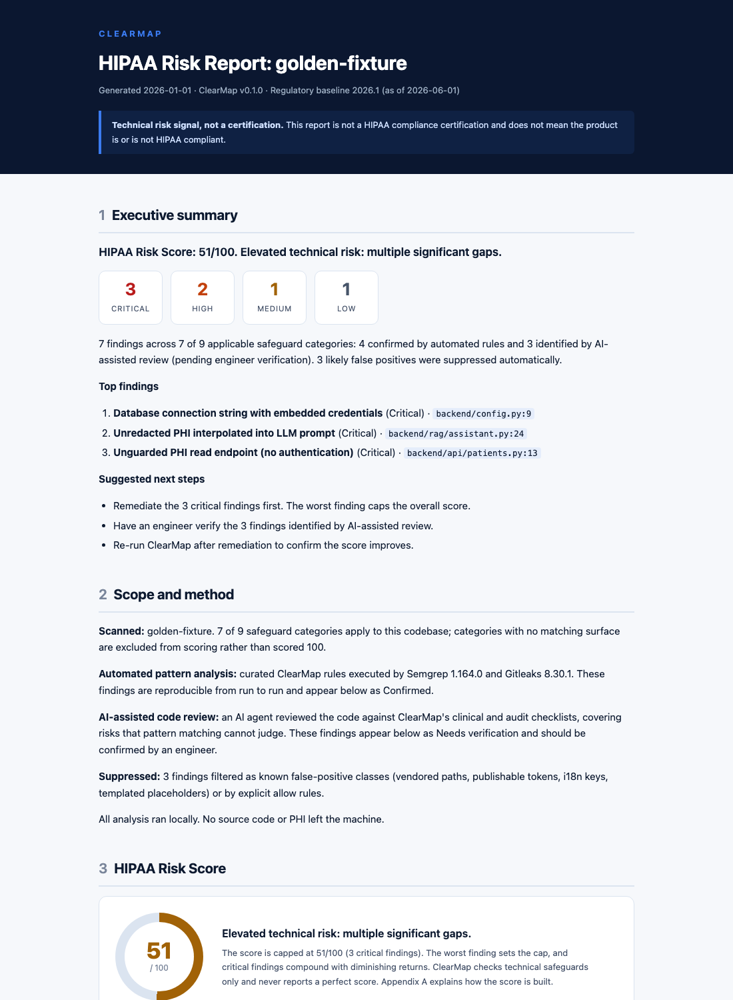

# ClearMap

[](https://github.com/vantage-io/clearmap/actions/workflows/ci.yml)
[](LICENSE)

**ClearMap by Vantage IO** is a HIPAA-aware plugin for AI coding agents. It helps Claude Code and Codex build safer healthcare software, then audits a repository when you ask. Everything runs on your machine. It is a technical-risk signal, not a HIPAA compliance certification.

## What it does

**Builds safer healthcare code.** Ask for something ordinary ("Add symptoms and SSN to the patient record") and ClearMap still ships the feature, but it questions whether the full SSN is needed, separates identity from clinical data, keeps PHI out of logs and prompts, and adds authentication and audit events.

**Audits a repository.** `/clearmap:audit .` runs the scanners, reviews the code, and prints the score inline:

```
ClearMap HIPAA Technical Risk Score: 68 (Assessment: Complete)
Findings: 2 critical, 4 high, 7 medium, 3 low
Reports: .clearmap/clearmap-report.md, .clearmap/clearmap-report.html
```

Findings map to HIPAA Security Rule technical safeguards (45 CFR 164.312) plus extensions (clinical AI/RAG, tracking, secrets, application-security). The report:



## Install in Claude Code

Run these two lines in a Claude Code session:

```
/plugin marketplace add Vantage-IO/clearmap
/plugin install clearmap@vantage-io
```

That's it. You won't see ClearMap under `/plugin` until you add the marketplace with the first line. Nothing else to configure: the AI-assisted review runs in Claude itself by default. Then build healthcare features normally, or run `/clearmap:audit .`.

## Install in Codex

The reliable way, which works on any Codex version, installs the ClearMap skills into your project:

```bash
git clone https://github.com/Vantage-IO/clearmap
python3 clearmap/scripts/install_agent_skills.py --scope user --agent codex
```

Then in Codex: "Use $clearmap-audit to audit this repository." Full details and the native-plugin option: [docs/codex.md](docs/codex.md).

## Local-first, and how to make it fully local

The scanner, scoring, and reports always run on your machine with no network calls. The only step that uses a model is the AI-assisted review. By default it runs in your coding agent (Claude Code or Codex), which means the code under review reaches that agent's provider as part of the agent's normal operation.

To keep everything on your machine, run `/clearmap:setup` and point ClearMap at a **local model** (Ollama or LM Studio): the review then never leaves your machine, not even to an agent. You can also choose a **remote model** such as OpenRouter if you prefer. Setup is optional; the default (your agent) needs no configuration. Details: [docs/advanced.md](docs/advanced.md).

## Token usage

Day to day this is a rounding error; only the audit spends real tokens, and only on demand.

- **Always-on:** about 700 tokens per session (the skill descriptions, so the agent knows when to help). Flat and trivial.
- **Regular development:** near zero on non-healthcare work. On healthcare work the development skill loads its guidance once, roughly 2k tokens for that task.
- **Audit:** the deterministic scan (Semgrep + Gitleaks) costs **zero** model tokens; it runs as local binaries and produces most findings. The AI-assisted review is the cost, and it scales with how much code it reads (think tens of thousands of tokens for a small-to-medium repo). It runs only when you ask for an audit.
- **Make audits free:** point the review at a local model with `/clearmap:setup`. Then the audit's reasoning runs on your machine and costs nothing against your Claude or Anthropic quota.

## Updating ClearMap

When a new version ships, refresh it.

**Claude Code:**

```
/plugin marketplace update vantage-io
/plugin update clearmap
```

Then restart Claude Code to apply the update.

**Codex** (Agent Skills install): pull the latest and reinstall over the old copy:

```bash
cd clearmap && git pull
python3 scripts/install_agent_skills.py --scope user --agent codex --force
```

## Generate the report in any format

The audit writes the report automatically; regenerate it in any format without re-scanning:

```
/clearmap:report html      # self-contained HTML
/clearmap:report md        # Markdown
/clearmap:report json      # machine-readable JSON of the issues
/clearmap:report all       # all three
```

In Codex or another agent: "Generate the ClearMap report as JSON." From the terminal: `clearmap report .clearmap/findings.json --format all`. Machine-readable exports (SARIF, CSV) via `clearmap export`. See [docs/auditing.md](docs/auditing.md).

## What ClearMap does not replace

Not a HIPAA compliance certification, and a score does not mean a product is or is not HIPAA compliant. Not a full or formal HIPAA audit. It does not cover administrative (164.308) or physical (164.310) safeguards, BAAs, policy, or a full risk analysis, and does not replace a security review, a penetration test, or counsel.

## More

- [docs/codex.md](docs/codex.md): Codex install and use
- [docs/auditing.md](docs/auditing.md): the audit, the report, and generating it
- [docs/advanced.md](docs/advanced.md): local/remote model setup, standalone CLI, other agents
- [SECURITY.md](SECURITY.md) · [CONTRIBUTING.md](CONTRIBUTING.md)

## License

Apache 2.0. See [LICENSE](LICENSE) and [NOTICE](NOTICE).

---

ClearMap is a partial, automated technical review, not a full HIPAA audit. For a deeper reliability assessment and expert assistance, visit [vantageio.com](https://vantageio.com).
